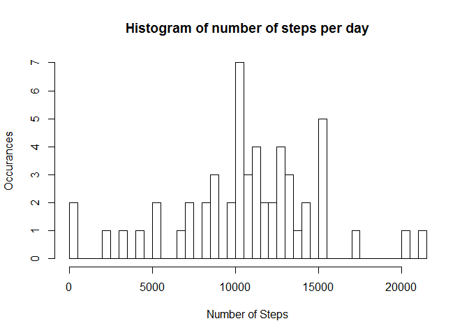
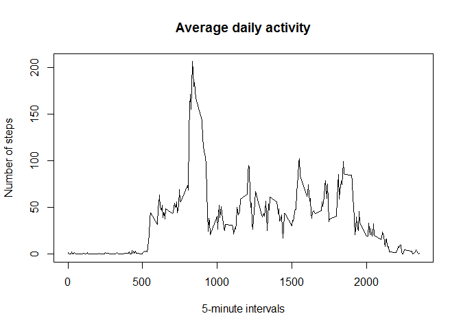
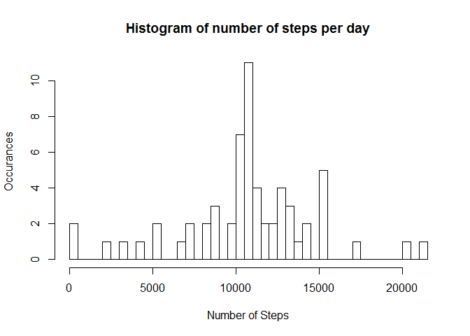
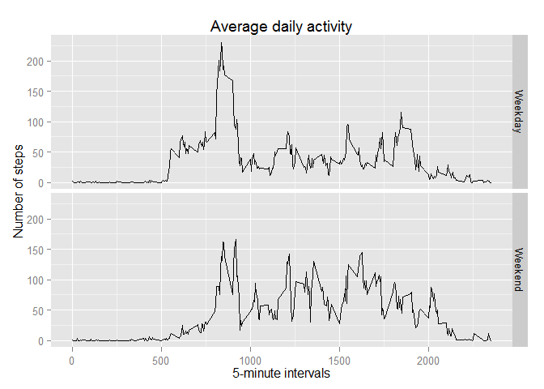

# Reproducible Research Peer Assessment 1
Solomon Davidsohn  
Saturday, July 19, 2014  

This assignment looks at data from activity monitoring devices taken at 5 minute intervals throughout the day.

Data source: https://d396qusza40orc.cloudfront.net/repdata%2Fdata%2Factivity.zip


## Loading and preprocessing the data

Download  and load the data.


```r
url <- "https://d396qusza40orc.cloudfront.net/repdata%2Fdata%2Factivity.zip"
if(!file.exists("RepDataSD.zip"))
    download.file(url,"RepDataSD.zip")

unzip("RepDataSD.zip")
data <- read.csv("activity.csv",stringsAsFactors = FALSE)
```


## What is mean total number of steps taken per day?

Find the histogram of the total number of steps taken each day.


```r
data$date <- as.Date(data$date, "%Y-%m-%d")
data <- data[complete.cases(data),]
countSteps <- aggregate(steps ~ date , data, sum)
hist(countSteps$steps, breaks = length(countSteps$date),xlab = "Number of Steps",
      ylab = "Occurances", main="Histogram of number of steps per day")
```

 

Calculate the mean and median of the total number of steps taken per day.


```r
mean(countSteps$steps)
```

```
## [1] 10766
```

```r
median(countSteps$steps)
```

```
## [1] 10765
```


## What is the average daily activity pattern?

Average daily activity pattern


```r
intervalDat <- aggregate (steps ~ interval , data, mean)
plot(intervalDat$interval, intervalDat$steps, type="l", xlab = "5-minute intervals",
     ylab ="Number of steps", main="Average daily activity")
```

 

Find the interval which contains the maximum number of steps.

```r
intervalDat[intervalDat$steps == max(intervalDat$steps),"interval"]
```

```
## [1] 835
```


## Inputing missing values

Create a dataset with filled in missing values. Our strategy for filling these
is to replace the NA's with the means of the intervals found in existing values.


```r
dataN <- read.csv("activity.csv",stringsAsFactors = FALSE)
dataN$date <- as.Date(dataN$date, "%Y-%m-%d")

#TRUE is the amount of NA's in the dataset
table(is.na(dataN))
```

```
## 
## FALSE  TRUE 
## 50400  2304
```

```r
dataNAs <- dataN[is.na(dataN),]
#go through every interval in the aggregate and replace the NAs using a forloop
for(x in intervalDat$interval)
 {
     dataNAs[dataNAs$interval==x,"steps"] <- intervalDat[intervalDat$interval==x,"steps"]
 }

dataN[is.na(dataN),] <- dataNAs
```

Redo the histogram and mean and median calculations for the new given NA values


```r
countSteps <- aggregate(steps ~ date , dataN, sum)
hist(countSteps$steps, breaks = length(countSteps$date),xlab = "Number of Steps",
      ylab = "Occurances", main="Histogram of number of steps per day")
```

 

```r
mean(countSteps$steps)
```

```
## [1] 10766
```

```r
median(countSteps$steps)
```

```
## [1] 10766
```

Looking at the plot and data, adding the NA values this way increased the most common bins in the histogram, the outlier values stayed the same while the 2 biggest values gained more occurances. The median also slightly changed to be closer to the mean.


## Are there differences in activity patterns between weekdays and weekends?

Create a factor separating Weekdays from Weekends and compare activities from the two.

```r
WeekdayFactor <- weekdays(dataN$date)
WeekdayFactor <- sapply(WeekdayFactor, function(x) 
        if(x=="Saturday" || x=="Sunday") 
                x<-"Weekend" 
        else 
            x<-"Weekday")
WeekdayFactor <- factor(WeekdayFactor)
dataNB <- cbind(dataN,WeekdayFactor)

intervalWF <- aggregate(steps ~ interval + WeekdayFactor,dataN,mean)

library(ggplot2)
qplot(interval,steps,data=intervalWF,facets = WeekdayFactor~.,geom="line",
       xlab="5-minute intervals",ylab="Number of steps", main="Average daily activity")
```

 

Daily activity from Weekdays has a different distribution of movement compared to the weekend, with weekdays having a large spike to movement in the beginning of the day, while weekends have more movement in the middle of the day.
